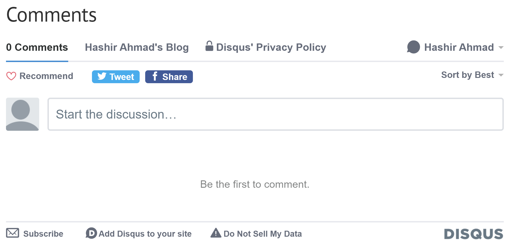
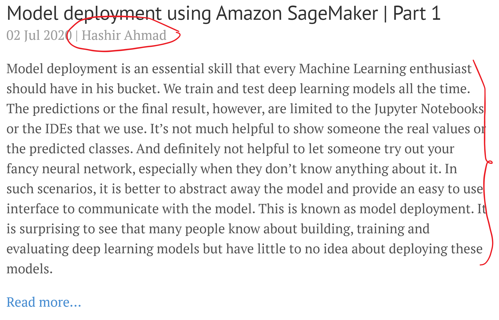

# Neuralife

Neuralife is the name of my [blog](https://hash-ir.github.io) created with ❤️ using Jekyll and github-pages. I write mostly about academic stuff, sometimes about fictional crossovers and philosophical stories. If you find something interesting on my blog, make sure to ⭐️ this repository so others can know about it.

## Contents
* [Installation](https://github.com/hash-ir/hash-ir.github.io#installation-deployment)
  * [Deployment](https://github.com/hash-ir/hash-ir.github.io#installation-deployment)
  * [Local development](https://github.com/hash-ir/hash-ir.github.io#installation-locally)
* [Usage](https://github.com/hash-ir/hash-ir.github.io#usage)
* [Features](https://github.com/hash-ir/hash-ir.github.io#features)
* [Contributing](https://github.com/hash-ir/hash-ir.github.io#contributing)
* [Credits](https://github.com/hash-ir/hash-ir.github.io#credits)
* [License](https://github.com/hash-ir/hash-ir.github.io#license)

## Installation (deployment)
With this, you will be able to use the features and create new posts only. Local development and live review is not possible:
1. Sign Up for a GitHub account if you don't have one.
2. For a minimal installation, fork the original lanyon [repository](https://github.com/poole/lanyon) by clicking the "Fork" button in the top right. Otherwise, for additional features, fork this repository.
3. Go to your forked repository settings. Rename the repository to [username].github.io.
4. Set site-wide configuration by editing the *_config.yml*. You can set the blog title, description, author and other meta features. Have a look [here](https://github.com/hash-ir/hash-ir.github.io/blob/master/_config.yml). 
5. Check status of your deployment in the repository settings under "GitHub pages" section.

## Installation (locally)
With this, you can locally run the jekyll site, preview posts and add new features or plugins:
1. Clone the forked repository after doing the steps above.
2. Install ruby, ruby-gems, jekyll and other dependencies from [here](https://jekyllrb.com/docs/installation/).
3. The plugins used in the site are listed in both *_config.yml* and *Gemfile*. Run `bundle clean` followed by `bundle install` to install the plugins. If there is any error, delete *Gemfile.lock* and try again.
4. In the repository directory, run `jekyll serve`. If everything works correctly, you will be able to see the local deployment. 

## Usage
[TODO]

## Features
I have used [Lanyon](https://lanyon.getpoole.com/), a minimalistic jekyll theme. I also added the following features on top which make this blog exceedingly amazing: 
### Disqus comments (June 10, 2020)
Sign up at [Disqus](https://disqus.com/). Go to settings and select *Add Disqus to Site*. Enter the site name and other details. Finally, select *Universal Code* as your platform. Save the universal code given under comment box. 

In `post.html` after the post content or where ever you want to display the comments, add the following:
```html

  <h2>Comments</h2>
  

```
The `if` logic only displays comments when they are turned on in the frontmatter (shown below). Now, create an html file `disqus.html` and a javascript file `disqus.js`. Add the following lines to `disqus.html`:
```html
<div id="disqus_thread"></div>
  <script src="/public/js/disqus.js"></script>
  <noscript>
    Please enable JavaScript to view the <a href="https://disqus.com/?ref_noscript">comments powered by Disqus.</a>
  </noscript>
```
In `disqus.js`, paste the universal code from before. For a post to display the comments, add the following in the post frontmatter.
```html
comments: true
```
If everything goes well, you will see something like this below your post:



### Author name and post excerpt (June 15, 2020)
This looks like below:



It can be done easily using Jekyll's Liquid templating. In order to display the author's name and excerpt on the post page as well as on the home page, we have to modify `post.html` and `index.html`. In the `<div class="post">` element of both files, add the following under `page.date` (`post.date` in `index.html`) variable:
```html

  | {{ page.author }}

```
The `author` variable is added in the post frontmatter as below:
```html
author: John Doe
```
For the post excerpt, we modify only the `index.html` and add `{{ post.excerpt }}` under author information. You can also add a *Read More...* hyperlink which opens the post page:
```html
<a href="{{ post.url | absolute_url }}">Read more...</a>
```
### Google Analytics (July 7, 2020)
[TODO]
### Categorization of posts by tags (August 20, 2020)
[TODO]
### MathJax support for math expressions (August 20, 2020)
[TODO]
### Link preview using `jekyll-seo-tag` (September 4, 2020)
[TODO]
### Create drafts of posts without publishing (September 4, 2020)
[TODO]

## Contributing
[TODO]

## Credits
[TODO]

## License
The license is extended from the source [repository](https://github.com/poole/lanyon). See the license [file](https://github.com/hash-ir/hash-ir.github.io/blob/master/LICENSE.md) for details.
